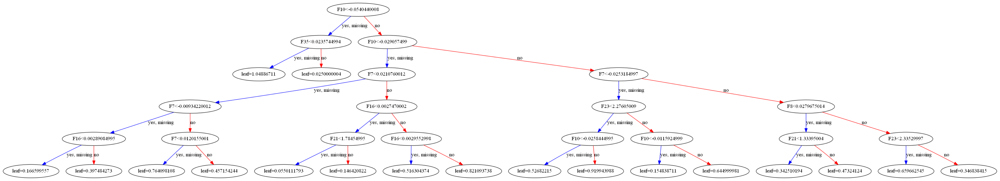

```python
import xgboost as xgb
from sklearn.metrics import mean_squared_error
import pandas as pd
import numpy as np
```


```python
data = pd.read_csv("https://archive.ics.uci.edu/ml/machine-learning-databases/00325/Sensorless_drive_diagnosis.txt", header=None, sep=" ")
data.head()
```


<div>
<style scoped>
    .dataframe tbody tr th:only-of-type {
        vertical-align: middle;
    }

    .dataframe tbody tr th {
        vertical-align: top;
    }

    .dataframe thead th {
        text-align: right;
    }
</style>
<table border="1" class="dataframe">
  <thead>
    <tr style="text-align: right;">
      <th></th>
      <th>0</th>
      <th>1</th>
      <th>2</th>
      <th>3</th>
      <th>4</th>
      <th>5</th>
      <th>6</th>
      <th>7</th>
      <th>8</th>
      <th>9</th>
      <th>...</th>
      <th>39</th>
      <th>40</th>
      <th>41</th>
      <th>42</th>
      <th>43</th>
      <th>44</th>
      <th>45</th>
      <th>46</th>
      <th>47</th>
      <th>48</th>
    </tr>
  </thead>
  <tbody>
    <tr>
      <th>0</th>
      <td>-3.014600e-07</td>
      <td>8.260300e-06</td>
      <td>-0.000012</td>
      <td>-0.000002</td>
      <td>-1.438600e-06</td>
      <td>-0.000021</td>
      <td>0.031718</td>
      <td>0.031710</td>
      <td>0.031721</td>
      <td>-0.032963</td>
      <td>...</td>
      <td>-0.63308</td>
      <td>2.9646</td>
      <td>8.1198</td>
      <td>-1.4961</td>
      <td>-1.4961</td>
      <td>-1.4961</td>
      <td>-1.4996</td>
      <td>-1.4996</td>
      <td>-1.4996</td>
      <td>1</td>
    </tr>
    <tr>
      <th>1</th>
      <td>2.913200e-06</td>
      <td>-5.247700e-06</td>
      <td>0.000003</td>
      <td>-0.000006</td>
      <td>2.778900e-06</td>
      <td>-0.000004</td>
      <td>0.030804</td>
      <td>0.030810</td>
      <td>0.030806</td>
      <td>-0.033520</td>
      <td>...</td>
      <td>-0.59314</td>
      <td>7.6252</td>
      <td>6.1690</td>
      <td>-1.4967</td>
      <td>-1.4967</td>
      <td>-1.4967</td>
      <td>-1.5005</td>
      <td>-1.5005</td>
      <td>-1.5005</td>
      <td>1</td>
    </tr>
    <tr>
      <th>2</th>
      <td>-2.951700e-06</td>
      <td>-3.184000e-06</td>
      <td>-0.000016</td>
      <td>-0.000001</td>
      <td>-1.575300e-06</td>
      <td>0.000017</td>
      <td>0.032877</td>
      <td>0.032880</td>
      <td>0.032896</td>
      <td>-0.029834</td>
      <td>...</td>
      <td>-0.63252</td>
      <td>2.7784</td>
      <td>5.3017</td>
      <td>-1.4983</td>
      <td>-1.4983</td>
      <td>-1.4982</td>
      <td>-1.4985</td>
      <td>-1.4985</td>
      <td>-1.4985</td>
      <td>1</td>
    </tr>
    <tr>
      <th>3</th>
      <td>-1.322600e-06</td>
      <td>8.820100e-06</td>
      <td>-0.000016</td>
      <td>-0.000005</td>
      <td>-7.282900e-07</td>
      <td>0.000004</td>
      <td>0.029410</td>
      <td>0.029401</td>
      <td>0.029417</td>
      <td>-0.030156</td>
      <td>...</td>
      <td>-0.62289</td>
      <td>6.5534</td>
      <td>6.2606</td>
      <td>-1.4963</td>
      <td>-1.4963</td>
      <td>-1.4963</td>
      <td>-1.4975</td>
      <td>-1.4975</td>
      <td>-1.4976</td>
      <td>1</td>
    </tr>
    <tr>
      <th>4</th>
      <td>-6.836600e-08</td>
      <td>5.666300e-07</td>
      <td>-0.000026</td>
      <td>-0.000006</td>
      <td>-7.940600e-07</td>
      <td>0.000013</td>
      <td>0.030119</td>
      <td>0.030119</td>
      <td>0.030145</td>
      <td>-0.031393</td>
      <td>...</td>
      <td>-0.63010</td>
      <td>4.5155</td>
      <td>9.5231</td>
      <td>-1.4958</td>
      <td>-1.4958</td>
      <td>-1.4958</td>
      <td>-1.4959</td>
      <td>-1.4959</td>
      <td>-1.4959</td>
      <td>1</td>
    </tr>
  </tbody>
</table>
<p>5 rows × 49 columns</p>
</div>


```python
data.columns = ['F' + str(i) for i in range(1,49)] + ['TARGET']
data.head()
```


<div>
<style scoped>
    .dataframe tbody tr th:only-of-type {
        vertical-align: middle;
    }

    .dataframe tbody tr th {
        vertical-align: top;
    }

    .dataframe thead th {
        text-align: right;
    }
</style>
<table border="1" class="dataframe">
  <thead>
    <tr style="text-align: right;">
      <th></th>
      <th>F1</th>
      <th>F2</th>
      <th>F3</th>
      <th>F4</th>
      <th>F5</th>
      <th>F6</th>
      <th>F7</th>
      <th>F8</th>
      <th>F9</th>
      <th>F10</th>
      <th>...</th>
      <th>F40</th>
      <th>F41</th>
      <th>F42</th>
      <th>F43</th>
      <th>F44</th>
      <th>F45</th>
      <th>F46</th>
      <th>F47</th>
      <th>F48</th>
      <th>TARGET</th>
    </tr>
  </thead>
  <tbody>
    <tr>
      <th>0</th>
      <td>-3.014600e-07</td>
      <td>8.260300e-06</td>
      <td>-0.000012</td>
      <td>-0.000002</td>
      <td>-1.438600e-06</td>
      <td>-0.000021</td>
      <td>0.031718</td>
      <td>0.031710</td>
      <td>0.031721</td>
      <td>-0.032963</td>
      <td>...</td>
      <td>-0.63308</td>
      <td>2.9646</td>
      <td>8.1198</td>
      <td>-1.4961</td>
      <td>-1.4961</td>
      <td>-1.4961</td>
      <td>-1.4996</td>
      <td>-1.4996</td>
      <td>-1.4996</td>
      <td>1</td>
    </tr>
    <tr>
      <th>1</th>
      <td>2.913200e-06</td>
      <td>-5.247700e-06</td>
      <td>0.000003</td>
      <td>-0.000006</td>
      <td>2.778900e-06</td>
      <td>-0.000004</td>
      <td>0.030804</td>
      <td>0.030810</td>
      <td>0.030806</td>
      <td>-0.033520</td>
      <td>...</td>
      <td>-0.59314</td>
      <td>7.6252</td>
      <td>6.1690</td>
      <td>-1.4967</td>
      <td>-1.4967</td>
      <td>-1.4967</td>
      <td>-1.5005</td>
      <td>-1.5005</td>
      <td>-1.5005</td>
      <td>1</td>
    </tr>
    <tr>
      <th>2</th>
      <td>-2.951700e-06</td>
      <td>-3.184000e-06</td>
      <td>-0.000016</td>
      <td>-0.000001</td>
      <td>-1.575300e-06</td>
      <td>0.000017</td>
      <td>0.032877</td>
      <td>0.032880</td>
      <td>0.032896</td>
      <td>-0.029834</td>
      <td>...</td>
      <td>-0.63252</td>
      <td>2.7784</td>
      <td>5.3017</td>
      <td>-1.4983</td>
      <td>-1.4983</td>
      <td>-1.4982</td>
      <td>-1.4985</td>
      <td>-1.4985</td>
      <td>-1.4985</td>
      <td>1</td>
    </tr>
    <tr>
      <th>3</th>
      <td>-1.322600e-06</td>
      <td>8.820100e-06</td>
      <td>-0.000016</td>
      <td>-0.000005</td>
      <td>-7.282900e-07</td>
      <td>0.000004</td>
      <td>0.029410</td>
      <td>0.029401</td>
      <td>0.029417</td>
      <td>-0.030156</td>
      <td>...</td>
      <td>-0.62289</td>
      <td>6.5534</td>
      <td>6.2606</td>
      <td>-1.4963</td>
      <td>-1.4963</td>
      <td>-1.4963</td>
      <td>-1.4975</td>
      <td>-1.4975</td>
      <td>-1.4976</td>
      <td>1</td>
    </tr>
    <tr>
      <th>4</th>
      <td>-6.836600e-08</td>
      <td>5.666300e-07</td>
      <td>-0.000026</td>
      <td>-0.000006</td>
      <td>-7.940600e-07</td>
      <td>0.000013</td>
      <td>0.030119</td>
      <td>0.030119</td>
      <td>0.030145</td>
      <td>-0.031393</td>
      <td>...</td>
      <td>-0.63010</td>
      <td>4.5155</td>
      <td>9.5231</td>
      <td>-1.4958</td>
      <td>-1.4958</td>
      <td>-1.4958</td>
      <td>-1.4959</td>
      <td>-1.4959</td>
      <td>-1.4959</td>
      <td>1</td>
    </tr>
  </tbody>
</table>
<p>5 rows × 49 columns</p>
</div>


```python
print(data.shape)
```

    (58509, 49)
    


```python
X, y = data.iloc[:,:-1],data.iloc[:,-1]
```


```python
data_dmatrix = xgb.DMatrix(data=X,label=y)
```


```python
from sklearn.model_selection import train_test_split

X_train, X_test, y_train, y_test = train_test_split(X, y, test_size=0.2, random_state=123)
```


```python
xg_reg = xgb.XGBClassifier(objective ='multi:softmax', colsample_bytree = 0.3, learning_rate = 0.1,
                max_depth = 5, alpha = 10, n_estimators = 10, num_class=11)
```


```python
xg_reg.fit(X_train,y_train)

preds = xg_reg.predict(X_test)
```

    [23:12:33] WARNING: C:/Users/Administrator/workspace/xgboost-win64_release_1.4.0/src/objective/regression_obj.cu:171: reg:linear is now deprecated in favor of reg:squarederror.
    


```python
rmse = np.sqrt(mean_squared_error(y_test, preds))
print("RMSE: %f" % (rmse))
```

    RMSE: 2.758655
    


```python
params = {"objective":"reg:linear",'colsample_bytree': 0.3,'learning_rate': 0.1,
                'max_depth': 5, 'alpha': 10}

cv_results = xgb.cv(dtrain=data_dmatrix, params=params, nfold=3,
                    num_boost_round=50,early_stopping_rounds=10,metrics="rmse", as_pandas=True, seed=123)
```

    [23:12:44] WARNING: C:/Users/Administrator/workspace/xgboost-win64_release_1.4.0/src/objective/regression_obj.cu:171: reg:linear is now deprecated in favor of reg:squarederror.
    [23:12:44] WARNING: C:/Users/Administrator/workspace/xgboost-win64_release_1.4.0/src/objective/regression_obj.cu:171: reg:linear is now deprecated in favor of reg:squarederror.
    [23:12:44] WARNING: C:/Users/Administrator/workspace/xgboost-win64_release_1.4.0/src/objective/regression_obj.cu:171: reg:linear is now deprecated in favor of reg:squarederror.
    


```python
cv_results.head()
```


<div>
<style scoped>
    .dataframe tbody tr th:only-of-type {
        vertical-align: middle;
    }

    .dataframe tbody tr th {
        vertical-align: top;
    }

    .dataframe thead th {
        text-align: right;
    }
</style>
<table border="1" class="dataframe">
  <thead>
    <tr style="text-align: right;">
      <th></th>
      <th>train-rmse-mean</th>
      <th>train-rmse-std</th>
      <th>test-rmse-mean</th>
      <th>test-rmse-std</th>
    </tr>
  </thead>
  <tbody>
    <tr>
      <th>0</th>
      <td>5.767955</td>
      <td>0.010027</td>
      <td>5.768191</td>
      <td>0.021508</td>
    </tr>
    <tr>
      <th>1</th>
      <td>5.277618</td>
      <td>0.016475</td>
      <td>5.277827</td>
      <td>0.016168</td>
    </tr>
    <tr>
      <th>2</th>
      <td>4.828896</td>
      <td>0.020744</td>
      <td>4.829144</td>
      <td>0.026268</td>
    </tr>
    <tr>
      <th>3</th>
      <td>4.418976</td>
      <td>0.012438</td>
      <td>4.420080</td>
      <td>0.022907</td>
    </tr>
    <tr>
      <th>4</th>
      <td>4.051585</td>
      <td>0.005608</td>
      <td>4.054033</td>
      <td>0.019870</td>
    </tr>
  </tbody>
</table>
</div>


```python
print((cv_results["test-rmse-mean"]).tail(4))
```

    46    0.999309
    47    0.987322
    48    0.975774
    49    0.964948
    Name: test-rmse-mean, dtype: float64
    


```python
import matplotlib.pyplot as plt

xgb.plot_tree(xg_reg,num_trees=0)
plt.rcParams['figure.figsize'] = [80, 10]
plt.show()
```


    

    


```python
xg_reg = xgb.train(params=params, dtrain=data_dmatrix, num_boost_round=10)
```

    [23:28:56] WARNING: C:/Users/Administrator/workspace/xgboost-win64_release_1.4.0/src/objective/regression_obj.cu:171: reg:linear is now deprecated in favor of reg:squarederror.
    


```python

```
